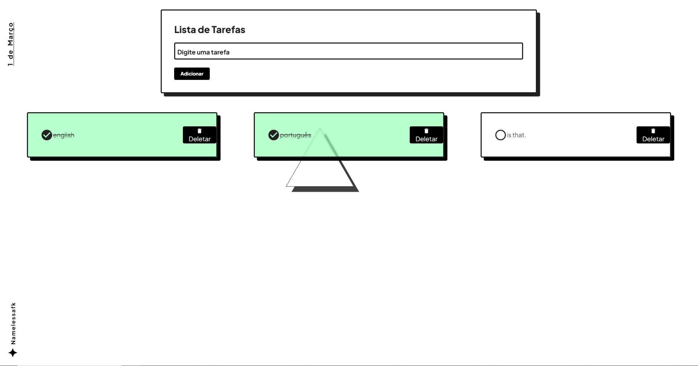

# (Português-Br)

# To-do List Aesthetic :astonished:

Este Projeto é basicamente um to-do list mas com uma vibe mais aesthetic, não sei exatamente qual seria esse estilo artístico. Mas me deixa bem confortavel ver ele assim.
Esse projeto também esta registrado no codepen: https://codepen.io/namelessafk/pen/PodpOqJ

Atualização: 
Depois de certas modificações o projeto agora é capaz de:

Ter um Filtro de Pesquisa pelo nome da tarefa,
Ter um Filtro por tipo de tarefa no caso, Todas, Concluidas e Em Andamento,
E uma função de cache local para que as tarefas fiquem salvas mesmo se fechar ou atualizar a pagina.

# Arquivos :skull:

Basicamente muito do nome das variáveis dos arquivos estão alguns em português e outros em inglês, sei que isso é um belo **erro de padronização** :skull: , mas no final não soube qual linguagem eu iria ficar melhor então acabei misturando.

# Projeto Sandbox? :dizzy_face:

Como o próprio conceito de Sandbox existe, ele serve como projeto escopo para que eu possa fazer implementações mais avançadas utilizando Javascript, e esse projeto também ajudaria essa parte de fazer implementações em um projeto "vivo".

- Também serve como um projeto que outras pessoas possam usar como base para fazer as implementações que quiserem sem precisar criar um próprio do zero.
	> Não ligo se copiarem meu projeto sem dar os créditos, apesar de eu achar babaquice, eu não julgo pois já fiz isso algumas vezes...:skull:
	
## Obrigado por ler ate aqui. :thumbsup:

Sinta-se livre para dar alguma ideia ou querer falar qualquer coisa sobre o projeto. :see_no_evil:

# (English)

# To-do List Aesthetic :astonished:

This Project is basically a to-do list but with a more aesthetic vibe, I don't know exactly what that artistic style would be. But it makes me very comfortable to see him like this.
This project is also registered on codepen: https://codepen.io/namelessafk/pen/PodpOqJ

Update:
After certain modifications the project is now capable of:

Have a Search Filter by task name,
Have a Filter by type of task in case, All, Completed and In Progress,
And a local cache function so tasks are saved even if you close or refresh the page.

# Files :skull:

Basically, many of the names of the variables in the files are in Portuguese and others in English, I know this is a beautiful **standardization error** :skull: , but in the end I didn't know which language I would be better at so I ended up mixing it up.

# Sandbox project? :dizzy_face:

As the Sandbox concept itself exists, it serves as a scope project so that I can make more advanced implementations using Javascript, and this project would also help that part of making implementations in a "live" project.

- It also serves as a project that other people can use as a base to make the implementations they want without having to create their own from scratch.
> I don't care if they copy my project without giving credits, although I think it's silly, I don't think so because I've done it a few times...:skull:

## Thanks for reading this far. :thumbsup:

Feel free to give any ideas or want to say anything about the project. :see_no_evil: